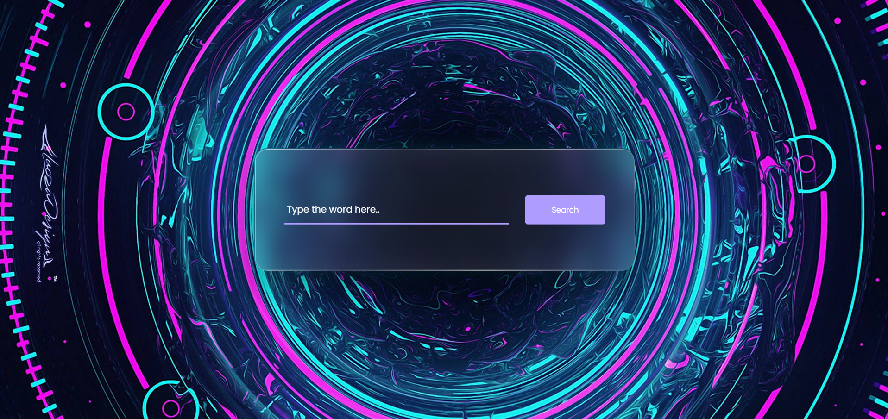
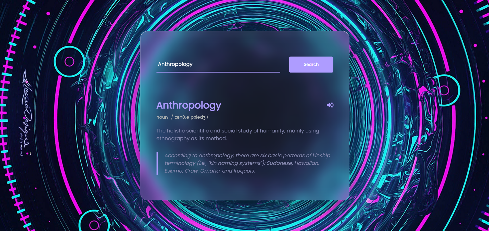

# 🌌 Dictionary App

A sleek and futuristic **Dictionary Web App** built using **HTML, CSS, and JavaScript**.

Search any English word and instantly get its definition, pronunciation, phonetics, examples, and more through a clean **cyberpunk-inspired glassmorphism interface**.

---

## ✨ Features

- 🔎 Search any English word instantly
- 📖 Get accurate word definitions
- 🏷️ View the part of speech (noun, verb, adjective, etc.)
- 🔤 Display phonetic pronunciation
- 🔊 Listen to audio pronunciation
- 💡 See example sentences when available
- ⚡ Fast and lightweight
- 📱 Fully responsive design
- 🎨 Modern glassmorphism + cyberpunk UI
- ❌ Handles invalid searches gracefully

---

## 📸 Screenshots

### Search Screen



### Result Screen



---

## 🛠️ Built With

- HTML5
- CSS3
- Vanilla JavaScript
- Fetch API
- DictionaryAPI

---

## 🌐 API Used

This project uses the free **DictionaryAPI**:

https://dictionaryapi.dev/

### Endpoint

```js
https://api.dictionaryapi.dev/api/v2/entries/en/<word>
```

### Example Request

```js
https://api.dictionaryapi.dev/api/v2/entries/en/anthropology
```

---

## ⚙️ How It Works

1. Enter a word into the search field.
2. Click the **Search** button.
3. The app sends a request using the Fetch API.
4. DictionaryAPI returns the word data.
5. The application dynamically displays:

   - Word
   - Part of speech
   - Phonetic pronunciation
   - Definition
   - Example sentence

6. The pronunciation audio is loaded into an `<audio>` element.
7. Click the speaker icon to hear the pronunciation.

---

## 🧠 JavaScript Concepts Used

- DOM Manipulation
- Event Listeners
- Fetch API
- Promises (`.then()` / `.catch()`)
- Template Literals
- Dynamic HTML Rendering
- Error Handling
- Audio Playback

---

## 📂 Project Structure

```bash
dictionary-app/
│
├── index.html
├── style.css
├── script.js
│
├── background.jpg
├── search.png
└── result.png
```

> Simple root-level structure with no frameworks or build tools required.

---

## 🚀 Getting Started

Clone the repository:

```bash
git clone https://github.com/Shabnam-Fatma/DictionaryApp.git
```

Navigate to the project folder:

```bash
cd dictionary-app
```

Open `index.html` in your browser.

That's it — no installation or dependencies required.

---

## 🐛 Error Handling

If a word cannot be found, the application displays:

```text
Couldn't find the word
```

This ensures a smooth and user-friendly experience.

---

## 🔮 Future Improvements

- ⌨️ Search using the Enter key
- 🕘 Recent search history
- ❤️ Favorite words
- 🌙 Dark/Light mode toggle
- 🌍 Multi-language support
- 🎤 Voice search
- 📱 Progressive Web App (PWA)

---

## 🤝 Contributing

Contributions, issues, and feature requests are welcome.

Feel free to fork this repository and submit a pull request.

---

## 📄 License

This project is licensed under the MIT License.

---

## 👩‍💻 Author

**Shabnam Fatma**

Junior Web Developer passionate about creating beautiful and interactive web experiences.

If you like this project, consider giving it a ⭐ on GitHub.